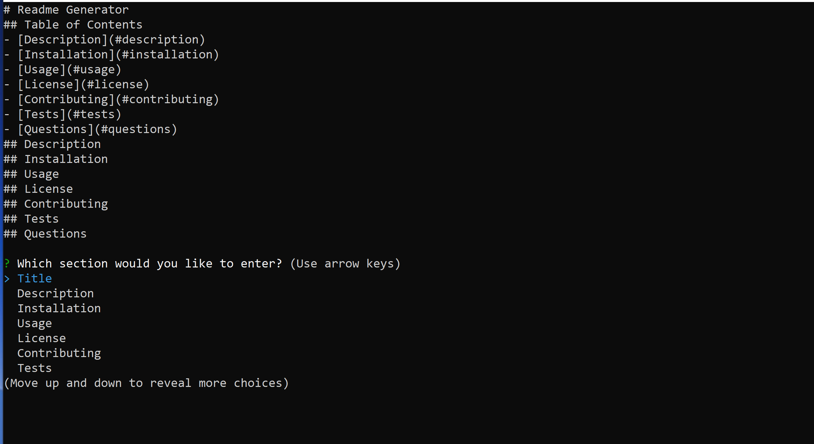

# Readme Generator

## Table of Contents 
- [Description](#description) 
- [Installation](#installation) 
- [Usage](#usage) 
- [License](#license) 
- [Contributing](#contributing) 
- [Tests](#tests) 
- [Questions](#questions) 
## Description 
Application to easily create README.md files for any project.   
Uses node.js from a command line to prompt for specific values that will be write to the new file.   

(https://watch.screencastify.com/v/cv8fbjS9b2VwMpSyJY2y "Presentation Video")
## Installation 
Requires the the "inquirer" package to be installed with npm   
clone repository from GitHub   
Run "npm install" in the cloned directory.   
## Usage 
Change directory to project root.   
run "node index.js" at command prompt  
## License 

 This application is covered by the Open license.
 ## Contributing 
Lewis Holgate   
## Tests 
None  
## Questions 
For any questions or comments, please contact Lewis Holgate at the email below.   
 Find me on GitHub: [lholgate](https://github.com/lholgate) 
Email me with any questions: lholgate6162@gmail.com 
https://watch.screencastify.com/v/cv8fbjS9b2VwMpSyJY2y